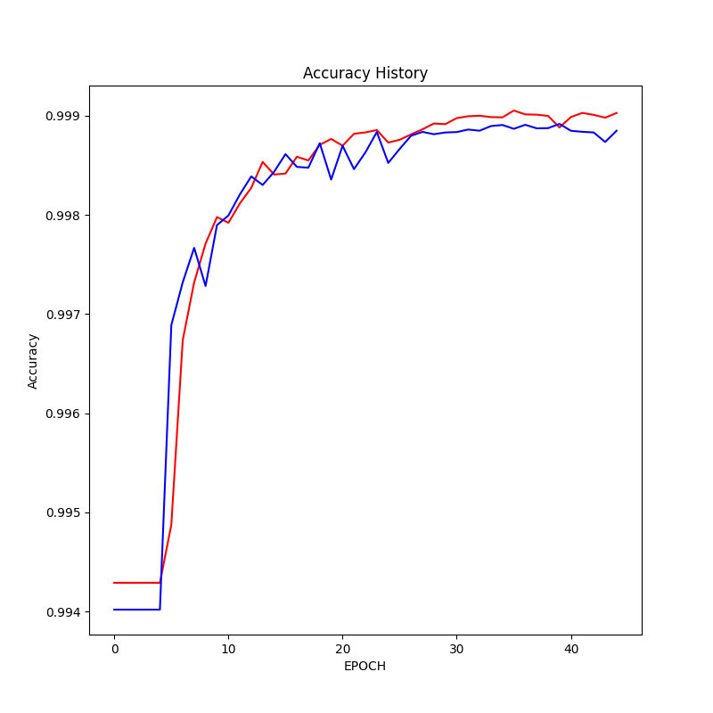
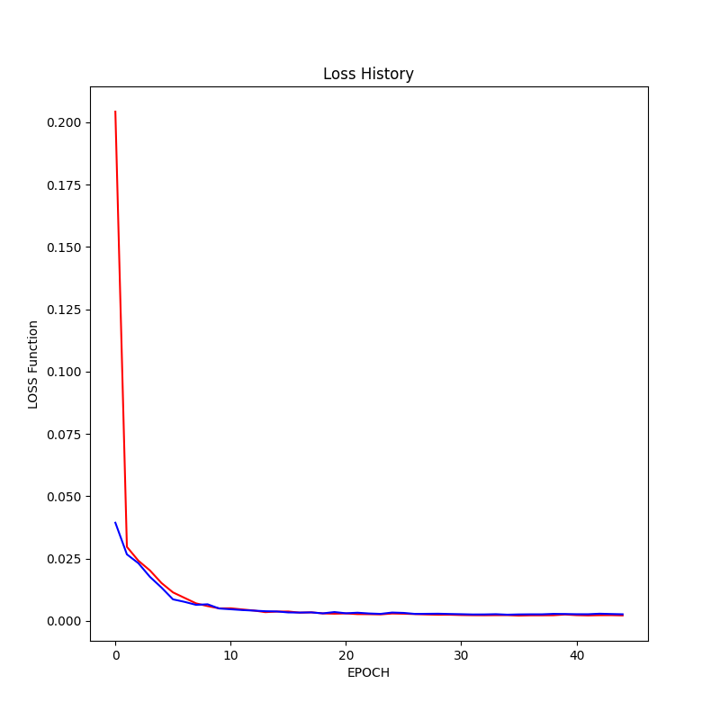

# U-Net for Lung Cancer Detection

## Overview

In this project, we leverage U-Net, an advanced deep learning model, to detect and locate lung cancer nodules in CT images of patients. This cutting-edge technology holds the potential to revolutionize the early diagnosis and treatment of lung cancer.

## Getting Started

To begin working on this project, follow these steps:

1. Determine the number of epochs for training. The default value is set at 50, but feel free to adjust it based on your specific requirements.

2. Start by reading and loading the dataset using the provided `data_reader` module.

3. Configure the U-Net model using the `unet` module. The model is designed to process 128x128 images.

4. Compile the U-Net model with Binary Cross-Entropy loss and the Adam optimizer. Accuracy metrics are included to assess the model's performance.

5. Initiate the training process, and monitor the validation loss for early stopping to prevent overfitting.

6. Visualize the training process and store the segmentation results in the `data_reader` module. The results provide information about the presence, location, and size of lung cancer nodules.

## Model Training and Performance

### Segmentation Results

[Segmentation Results](/results) - Explore the segmentation results obtained from the U-Net model. These results showcase the detected lung cancer nodules.

### Accuracy History

The above chart displays the accuracy history of the AI model during training. It shows how the model's accuracy improves over epochs.

### Training History

The training history chart illustrates the loss function's change during model training. It provides insights into the model's learning progress.

## Future Developments

This project signifies a major advancement in the field of medical imaging. The AI system can provide invaluable assistance to medical professionals by rapidly identifying lung cancer nodules, simplifying the early stages of cancer treatment.

## License

The license for this project is currently under review. Please refer to the project documentation or License.txt file for further information.
