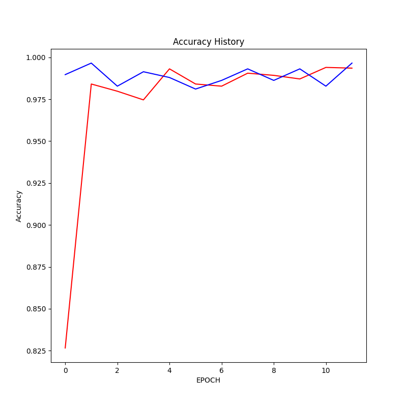
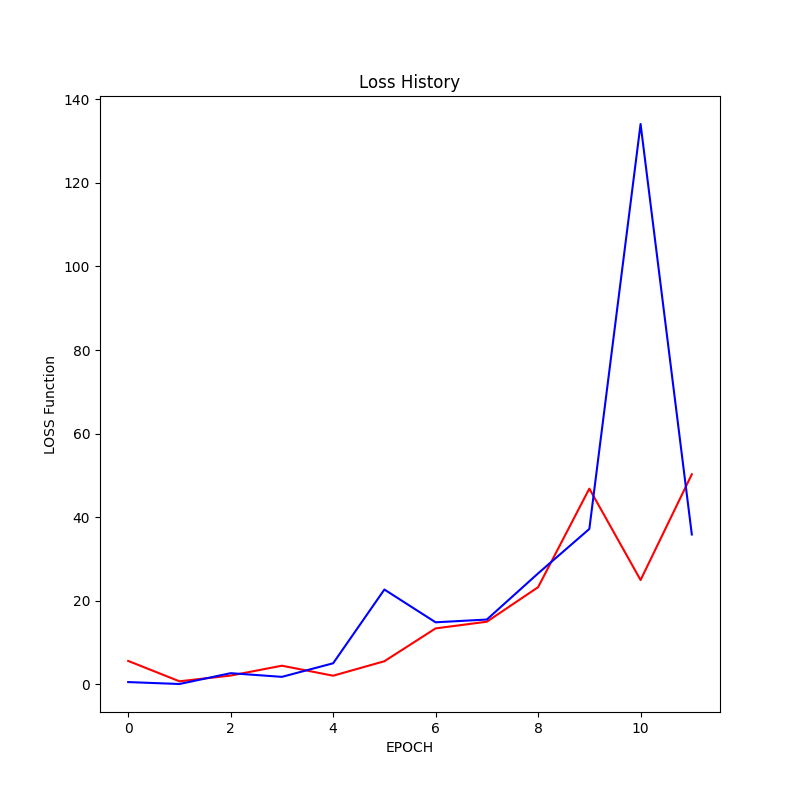

# Genetic-Based Cancer Diagnosis AI

## Overview

This project aims to develop an artificial intelligence model to analyze genetic-based data and determine the type of cancer a patient has. The AI model can accurately classify cancer types based on the given genetic data and is optimized to address memory issues, making it run smoothly even on low-spec computers.

## Data

The genetic data used for training was collected using RNA Sequencing technology. Typically, this technology requires around 50mg to 200mg of samples, equivalent to the amount of blood in 1 to 4 droplets. This project could pave the way for diagnosing cancer with just a few droplets of blood in the future.

## Model

The primary model in this project is a Classification model. It utilizes genetic data to accurately classify the type of cancer a patient may have.

## Getting Started

If you're interested in running or contributing to this project, please follow these steps:

1. Clone this repository to your local machine.

2. If you encounter GPU memory issues, navigate to the `[GPU memory is insufficient]` folder and run the `main.py` file. This optimized version of the analysis reduces memory requirements, making it suitable for lower-end computers.

3. Explore the code, datasets, and AI model. Feel free to make contributions or improvements.

## Model Training and Performance

### Accuracy History

The above chart displays the accuracy history of the AI model during training. It shows how the model's accuracy improves over epochs.

### Training History

The training history chart illustrates the loss function's change during model training. It provides insights into the model's learning progress.

## Future Outlook

This project is expected to bring innovation to the field of cancer diagnosis. In the future, it may become possible to diagnose cancer accurately with smaller samples, providing patients with faster diagnosis and treatment opportunities.

## License

The license for this project is currently under review. Please refer to the project documentation or License.txt file for further information.

---
