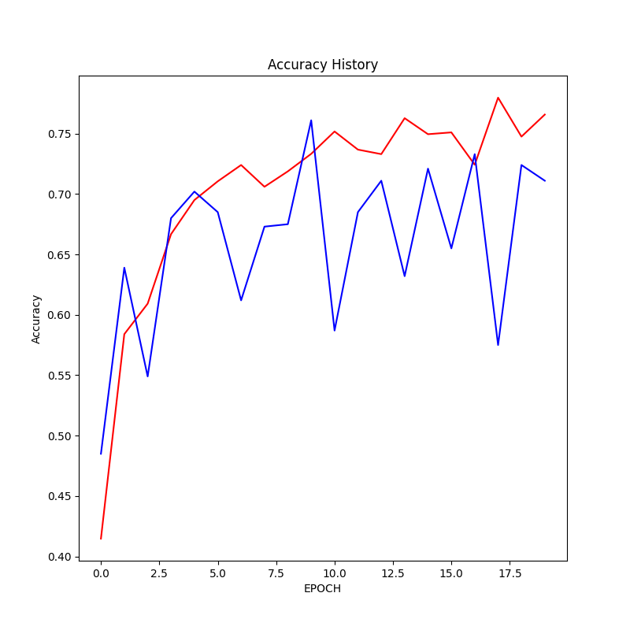
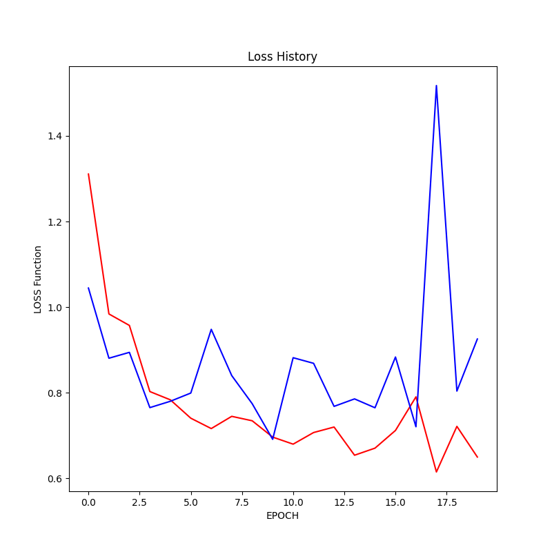

# AI for Multi-Class Classification of Microscopic Images

## Overview

In this project, we tackle a challenging task of classifying microscopic images into eight distinct categories. The AI system has the capability to discern various cell types in complex microscopic images, indicating the origin of the samples within each image.

## Getting Started

To begin the project, you can follow the steps below:

1. Determine the number of epochs for training. The default value is set at 20, but you can adjust it according to your requirements.

2. Start by reading and loading the data. The dataset can be obtained using the provided `data_reader` module.

3. Create a Convolutional Neural Network (CNN) for image classification. The model is designed as follows:

   - Input Layer
   - Convolutional Layer 1 with 16 filters and ReLU activation
   - Max-Pooling Layer 1
   - Convolutional Layer 2 with 32 filters and ReLU activation
   - Max-Pooling Layer 2
   - Convolutional Layer 3 with 64 filters and ReLU activation
   - Max-Pooling Layer 3
   - Convolutional Layer 4 with 64 filters and ReLU activation
   - Max-Pooling Layer 4
   - Convolutional Layer 5 with 64 filters and ReLU activation
   - Max-Pooling Layer 5
   - Flattening Layer
   - Dense Layer 1 with 512 units and ReLU activation
   - Output Layer with 8 units using a softmax activation function for multi-class classification.

4. Compile the CNN model using the Adam optimizer, accuracy metrics, and the sparse categorical cross-entropy loss function.

5. Initiate the model training process, and monitor the validation loss to determine the optimal stopping point. Early stopping is used to prevent overfitting.

6. Visualize the training process using graphs.

## Model Training and Performance

### Sample Images

[Sample Images](data/images) - Explore a set of images featuring complex mixtures of cells from various tissues. The AI is capable of distinguishing the different cell types and their origins within the images.

### Accuracy History

The above chart displays the accuracy history of the AI model during training. It shows how the model's accuracy improves over epochs.

### Training History

The training history chart illustrates the loss function's change during model training. It provides insights into the model's learning progress.

## Future Developments

This project lays the foundation for cutting-edge AI applications in the medical field. As the AI system becomes more advanced, it could significantly reduce the time required for the analysis of microscopic images, aiding medical professionals in the diagnosis and treatment of diseases.

## License

The license for this project is currently under review. Please refer to the project documentation or License.txt file for further information.

---
